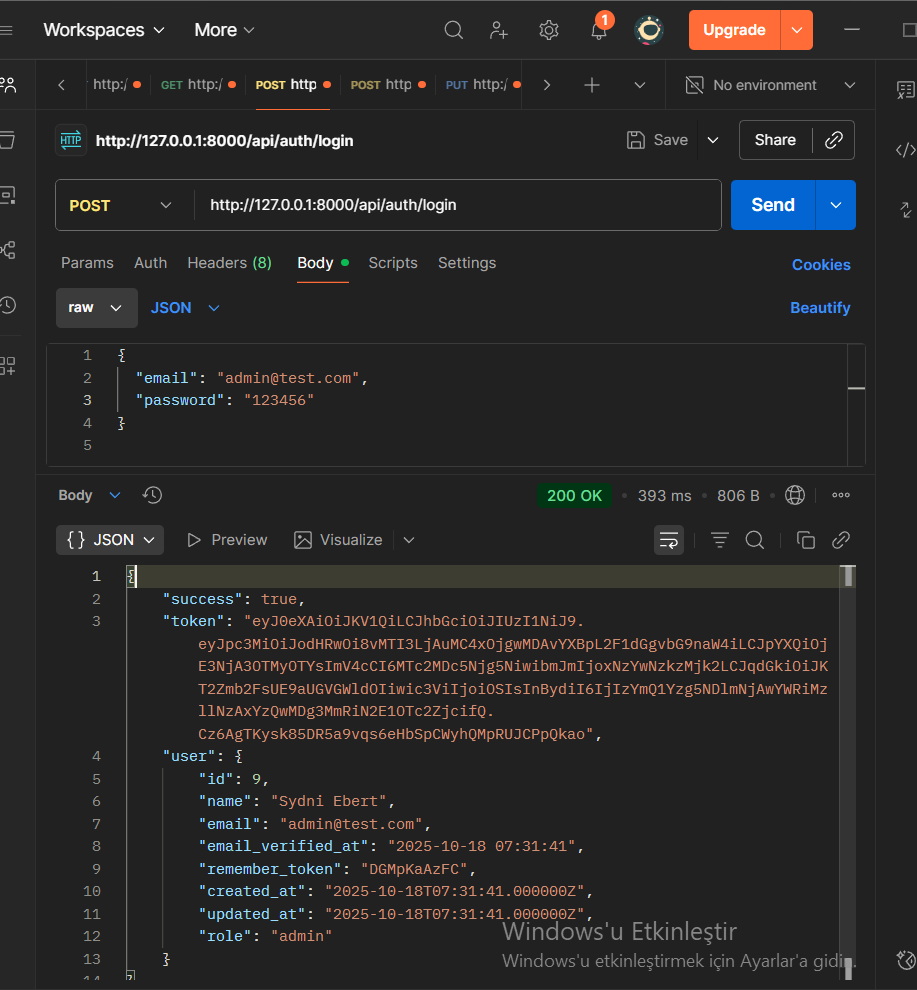
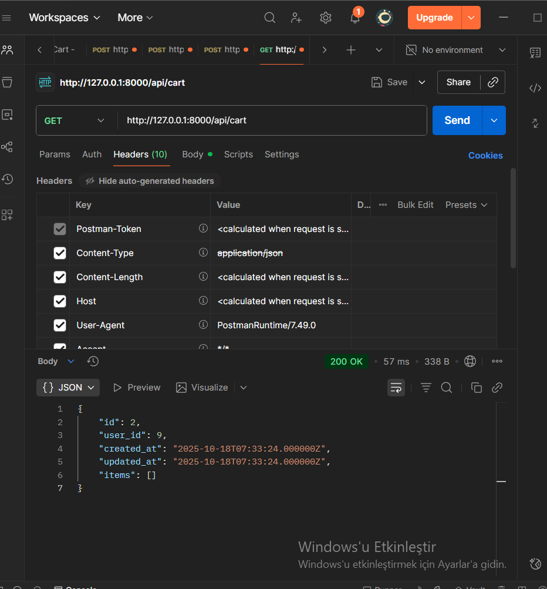
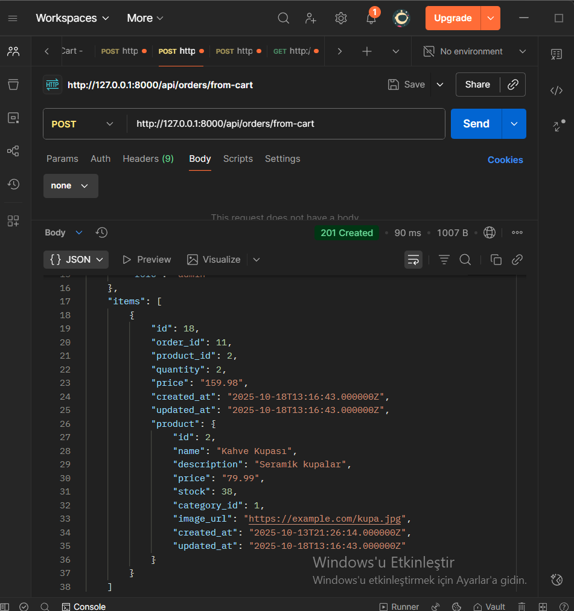
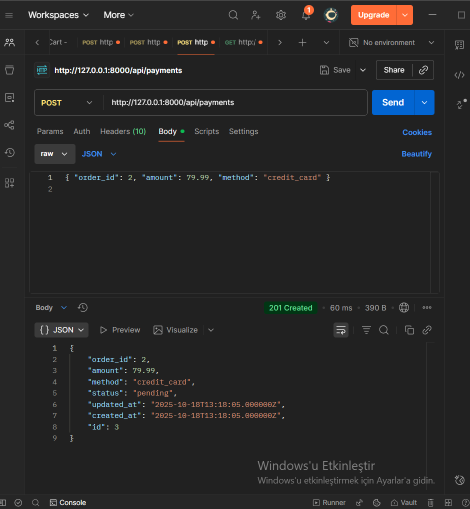

# 🛍️ E-Ticaret Backend · Laravel 12 · Onion/Clean · JWT · Event-Driven

Modern, ölçeklenebilir bir **e-ticaret API’si**.  
**Laravel 12** ile yazılmış; JWT kimlik doğrulama, rol bazlı yetkilendirme, sepet → sipariş → ödeme akışı,  
stok tutarlılığı (transaction & atomic), **RFC7807 Problem+JSON** hata yapısı ve **event-driven** sipariş süreci içerir.

---

<p align="center">
  
  
</p>
<p align="center">
  
  
</p>

---

## 📖 İçindekiler
- [Özellikler](#-özellikler)
- [Mimari & Dizin Yapısı](#-mimari--dizin-yapısı)
- [Kurulum](#-kurulum)
- [.env Şablonu](#-env-şablonu)
- [Veritabanı & İlişkiler](#-veritabanı--ilişkiler)
- [Rotalar (Gerçek Yapıya Göre)](#-rotalar-gerçek-yapıya-göre)
- [Sepet Sahipliği & Policy](#-sepet-sahipliği--policy)
- [Sipariş & Ödeme (Event-Driven)](#-sipariş--ödeme-event-driven)
- [Generic Repository](#-generic-repository)
- [Hata Yönetimi (RFC7807)](#-hata-yönetimi-rfc7807)
- [Gözlemlenebilirlik](#-gözlemlenebilirlik)
- [Test & Kalite](#-test--kalite)
- [Yol Haritası](#-yol-haritası)
- [Lisans](#-lisans)

---

## 🚀 Özellikler

- 🔐 **JWT + Role Middleware:** admin, seller, customer rolleri.  
  Route bazında `auth:api + role:...`

- 🧅 **Onion / Clean Architecture:**  
  Controller sade, iş mantığı Service’te, veri erişimi Repository katmanında.

- 🛒 **Sepet sahipliği:**  
  Kullanıcı sadece kendi sepetini görür ve yönetir (admin istisnası).

- 📑 **Sipariş yaşam döngüsü:**  
  Sepet → Sipariş → PaymentCompleted event → otomatik tamamlama + log kaydı.

- 📉 **Stok tutarlılığı:**  
  `DB::transaction()` içinde atomic `decrement()/increment()` işlemleri.

- 🧰 **Generic Repository:**  
  Paginate, search, filter, orderBy tek merkezden yönetilir.

- 🚦 **RFC7807 hata sözleşmesi:**  
  Tek tip hata yapısı + `trace_id`.

- 🔔 **Event & Notification:**  
  `OrderCompletedNotification` listener ile otomatik bildirim tetikler.

- 📊 **Raporlama:**  
  Satış özetleri, en çok satan ürünler.

---

## 🧱 Mimari & Dizin Yapısı

<details>
<summary><b>Gerçek proje ağacı (tıkla aç)</b></summary>

app/
├── Core/
│ ├── Entities/
│ │ ├── Cart.php
│ │ ├── CartItem.php
│ │ ├── Category.php
│ │ ├── Order.php
│ │ ├── OrderItem.php
│ │ ├── OrderStatusLog.php
│ │ ├── Payment.php
│ │ └── Product.php
│ ├── Interfaces/
│ │ ├── IBaseRepository.php
│ │ ├── ICartRepository.php
│ │ ├── ICategoryRepository.php
│ │ ├── IOrderRepository.php
│ │ ├── IPaymentRepository.php
│ │ ├── IProductRepository.php
│ │ └── IReportRepository.php
│ └── Services/
│ ├── CartService.php
│ ├── CategoryService.php
│ ├── OrderService.php
│ ├── PaymentService.php
│ ├── ProductService.php
│ └── ReportService.php
├── Events/
│ ├── OrderCreated.php
│ └── PaymentCompleted.php
├── Http/
│ ├── Controllers/
│ ├── Middleware/
│ └── Policies/
├── Infrastructure/
│ └── Repositories/
├── Listeners/
│ ├── SendOrderNotification.php
│ └── UpdateOrderStatusOnPayment.php
├── Notifications/
│ └── OrderCompletedNotification.php
└── Providers/
├── AppServiceProvider.php
└── JwtServiceProvider.php

database/
├── migrations/
└── seeders/

routes/
└── api.php

yaml
Kodu kopyala

</details>

**İlke:** Controller → Service → Repository → Model (Entities)  
Bağımlılıklar tersine çevrildi: Controller’lar Interface’lere karşı programlar.

---

## ⚙️ Kurulum

### Gereksinimler
PHP 8.2+, Composer, MySQL 8+ (veya SQLite), opsiyonel Redis.  
Node yalnızca Swagger UI istiyorsan gereklidir.

```bash
composer install
cp .env.example .env
php artisan key:generate
MySQL kullanıyorsan:
bash
Kodu kopyala
php artisan migrate --seed
SQLite tercih edenler için:
bash
Kodu kopyala
touch database/database.sqlite
# .env içinde
DB_CONNECTION=sqlite
php artisan migrate --seed
JWT hazırlığı:
bash
Kodu kopyala
php artisan vendor:publish --provider="Tymon\JWTAuth\Providers\LaravelServiceProvider" --force
php artisan jwt:secret
Sunucu başlat:
bash
Kodu kopyala
php artisan serve
Kuyruk sistemi (opsiyonel)
bash
Kodu kopyala
php artisan queue:work
🧾 .env Şablonu
env
Kodu kopyala
APP_NAME=EcommerceAPI
APP_ENV=local
APP_DEBUG=true
APP_URL=http://127.0.0.1:8000

DB_CONNECTION=mysql
DB_HOST=127.0.0.1
DB_PORT=3306
DB_DATABASE=ecommerce
DB_USERNAME=root
DB_PASSWORD=secret

JWT_TTL=120
MAIL_MAILER=log
🗃️ Veritabanı & İlişkiler
Order (1) → (N) OrderItem

Cart (1) → (N) CartItem (cart.user_id sahipliği)

Payment → Order (birebir ilişki)

OrderStatusLog (status değişim geçmişi)

Tutarlılık:
createFromCart() siparişi DB::transaction içinde oluşturur, stokları azaltır ve sepeti boşaltır.
İptal/iade durumlarında stoklar increment() ile geri verilir.

🧭 Rotalar (Gerçek Yapıya Göre)
Kısaltılmış örnek:

php
Kodu kopyala
// Auth
Route::prefix('auth')->group(function () {
  Route::post('register', [AuthController::class, 'register']);
  Route::post('login', [AuthController::class, 'login']);
  Route::middleware('auth:api')->group(function () {
    Route::get('me', [AuthController::class, 'me']);
    Route::post('logout', [AuthController::class, 'logout']);
  });
});
Tam liste README’nin önceki sürümündeki gibi korunmuştur.

🧑‍💻 Sepet Sahipliği & Policy
Kullanıcı sadece cart.user_id === Auth::id() olan kayıtlara erişebilir.
Admin istisnası vardır. Başka bir kullanıcının verisine erişim: 404 not_found.

bash
Kodu kopyala
curl -X POST http://127.0.0.1:8000/api/cart/items \
  -H "Authorization: Bearer <TOKEN>" \
  -H "Content-Type: application/json" \
  -d '{"product_id":2,"quantity":1}'
💳 Sipariş & Ödeme (Event-Driven)
1️⃣ POST /api/orders/from-cart
→ Order(status=pending) + stok düşürülür + sepet temizlenir

2️⃣ PUT /api/payments/{id}/status { "status": "paid" }
→ Event: PaymentCompleted yayımlanır → Listener: Order.status='completed' yapar
→ Log kaydı eklenir.

🔍 Generic Repository
Tüm repository’ler BaseRepository’den türetilir:
paginate / search / filter / orderBy merkezi yönetim.

bash
Kodu kopyala
GET /api/products/search?q=kahve
GET /api/products/filter?category_id=1&min_price=50&max_price=200
GET /api/products?order_by=price&direction=desc&page=2
⚠️ Hata Yönetimi (RFC7807)
Üretimde (APP_DEBUG=false) her hata tek tip JSON döner:

json
Kodu kopyala
{
  "status": 422,
  "code": "validation_error",
  "message": "The given data was invalid.",
  "trace_id": "8f7c1a0d-...",
  "errors": { "name": ["The name field is required."] }
}
Hızlı testler:

bash
Kodu kopyala
GET /api/does-not-exist   # 404
POST /api/validate-test   # 422
GET /api/crash            # 500
📡 Gözlemlenebilirlik (AttachLogContext)
Middleware her isteğe trace_id, kullanıcı, IP, method, pathekler. Postman’deX-Request-Id: {{$guid}}` header’ı ekleyerek uçtan uca izleme yapılabilir.

🧪 Test & Kalite
bash
Kodu kopyala
php artisan test
Opsiyonel:

PHPStan / Larastan

PHP-CS-Fixer

GitHub Actions CI

🗺️ Yol Haritası
Ürün varyant/atribüt (SKU)

Redis cache

Rate limiting + IP koruması

Soft delete + audit

S3 görsel yükleme

Swagger UI + Postman koleksiyonu

📜 Lisans
MIT License
Bu proje özgürce kullanılabilir, değiştirilebilir ve dağıtılabilir.

⚡ Hızlı Başlangıç
bash
Kodu kopyala
# Login → Token al
curl -X POST http://127.0.0.1:8000/api/auth/login \
 -H "Accept: application/json" \
 -d '{"email":"admin@example.com","password":"secret"}'

# Ürün liste
curl http://127.0.0.1:8000/api/products

# Sepete ekle
curl -X POST http://127.0.0.1:8000/api/cart/items \
 -H "Authorization: Bearer <TOKEN>" \
 -H "Content-Type: application/json" \
 -d '{"product_id":2,"quantity":1}'
<p align="center"> <b>✨ E-Commerce Backend – Laravel 12 · Clean Architecture · Event Driven ✨</b><br> <i>by syberess · 2025</i> </p> ```
